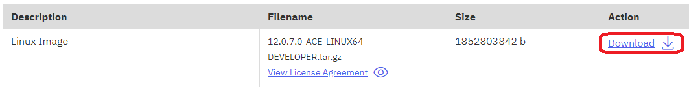

# Experimental docker files

Simple docker images for ACE v12 on Linux (amd64 and s390x) and Windows

ace-full contains a Dockerfile for building an image that can run the full product, including mqsicreatebar with a virtual X server.

ace-basic contains a Dockerfile for building an image that can run the product server, including all files except the toolkit.

ace-minimal contains the Dockerfiles for building images that can run simple servers with a non-root user.

ace-sample contains a sample BAR file and Dockerfiles for building runnable images to serve HTTP clients.

See build-all.sh for details on building the images; setting LICENSE=accept is required for all but the initial image builds.

## Setting the correct product version

The aceDownloadUrl value in ace-minimal-image-pipeline-run.yaml is likely to need updating, either to another version
in the same server directory (if available) or else to an ACE developer edition URL from the IBM website. In the latter
case, start at https://www.ibm.com/docs/en/app-connect/12.0?topic=enterprise-download-ace-developer-edition-get-started
and proceed through the pages until the main download page with a link: 



The link is likely to be of the form
```
https://iwm.dhe.ibm.com/sdfdl/v2/regs2/mbford/Xa.2/Xb.WJL1cUPI9gANEhP8GuPD_qX1rj6x5R4yTUM7s_C2ue8/Xc.12.0.7.0-ACE-LINUX64-DEVELOPER.tar.gz/Xd./Xf.LpR.D1vk/Xg.12164875/Xi.swg-wmbfd/XY.regsrvs/XZ.pPVETUejcqPsVfDVKbdNu6IRpo4TkyKu/12.0.7.0-ACE-LINUX64-DEVELOPER.tar.gz
```
Copy that link into the aceDownloadUrl parameter, adjusting the version numbers in the other files as needed.

## Running the sample

To run the sample after building:
```
docker run -e LICENSE=accept --rm -ti ace-sample:12.0.7.0-alpine
```
and then curl http://[container IP]:7800/test should return '{"data":"a string from ACE"}'

## Various sizes
Local on Ubuntu with defaults in Dockerfiles:

```
ace-basic        12.0.7.0-ubuntu               69f66523df16   About a minute ago       1.78GB
ace-full         12.0.7.0-ubuntu               2b77ec0f9a71        2 minutes ago       4.15GB
ace-minimal      12.0.7.0-ubuntu               0b662240db80       13 minutes ago        738MB
ace-minimal      12.0.7.0-alpine               c5d126442f73       15 minutes ago        644MB
```

Some of these will fit into the IBM Cloud container registry free tier due to compression, but ace-full and ace-basic are too big for that.

