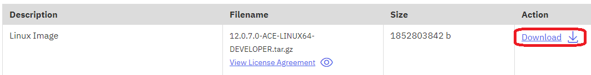

# Experimental docker files

Simple docker images for ACE v13 on Linux (amd64 and s390x) and Windows

These images are intended to show various ways to build containers for various purposes with
varying sizes, depending on the use case. All are built from the same ACE product package, and
the general picture looks like this:


Dockerfiles for the various options are in the following directories:

- ace-full can run the full product, including mqsicreatebar with a virtual X server.
- ace-basic can run the product server, including all files except the toolkit.
- ace-minimal can run simple servers with a non-root user, and can be configured to install an MQ client.
- ace-sample contains a sample BAR file and Dockerfiles for building runnable images to serve HTTP clients.
- devcontainers is used with GitHub Codespaces to allow container-based development with VisualStudio Code in a web browser.

See build-all.sh for details on building the images; setting LICENSE=accept is required for all but the initial image builds.

## Setting the correct product URL

The Dockerfiles in the various directories take a `DOWNLOAD_URL` parameter that may
need to be specified to build a specific version of the product. This is provided on
the command line using the `--build-arg` parameter, and for the demo repos that use
Tekton to build the image, the URL is the `aceDownloadUrl` value in ace-minimal-image-pipeline-run.yaml.

This value may need updating, either to another version in the same server directory
(if available) or else to an ACE evaluation edition (previously known as the "developer edition) 
URL from the IBM website. In the latter case, start at
https://www.ibm.com/docs/en/app-connect/13.0?topic=enterprise-download-ace-developer-edition-get-started
and proceed through the pages until the main download page with a link: 



The link is likely to be of the form
```
https://iwm.dhe.ibm.com/sdfdl/v2/regs2/mbford/Xa.2/Xb.WJL1cUPI9gANEhP8GuPD_qX1rj6x5R4yTUM7s_C2ue8/Xc.13.0.4.0-ACE-LINUX64-EVALUATION.tar.gz/Xd./Xf.LpR.D1vk/Xg.12164875/Xi.swg-wmbfd/XY.regsrvs/XZ.pPVETUejcqPsVfDVKbdNu6IRpo4TkyKu/13.0.4.0-ACE-LINUX64-EVALUATION.tar.gz
```
Copy that link into the aceDownloadUrl parameter or use it as the DOWNLOAD_URL build
parameter, adjusting the version numbers in the other files and parameters as needed.

## Running the sample

To run the sample after building:
```
docker run -e LICENSE=accept --rm -ti ace-sample:13.0.4.0-alpine
```
and then `curl http://[container IP]:7800/test` should return '{"data":"a string from ACE"}'

## Various sizes

Local on Ubuntu with defaults in Dockerfiles:

```
ace-minimal                13.0.4.0-alpine-java8     8ced641cbc9d  8 weeks ago   762MB
ace-minimal                13.0.4.0-alpine           bf88f5220666  8 weeks ago   811MB
ace-minimal                13.0.4.0-alpine-mqclient  70d1956d93e2  8 weeks ago   963MB
ace-minimal                13.0.4.0-ubuntu           942cd6ea5243  8 weeks ago   1.16GB
ace-minimal-devcontainer   13.0.4.0                  9154ea32ec9a  8 weeks ago   1.51GB
ace-devcontainer           13.0.4.0                  cea5a3bdf889  8 weeks ago   2.25GB
ace-devcontainer-mqclient  13.0.4.0                  0b6b0adc1ae9  8 weeks ago   2.52GB
ace-basic                  13.0.4.0-ubuntu           a34cb877aadc  8 weeks ago   3.38GB
ace-full                   13.0.4.0-ubuntu           6dba71e0c668  8 weeks ago   6.27GB
```

Compressed sizes on DockerHub:

```
ace-minimal               13.0.4.0-alpine-java8         434.97 MB
ace-minimal               13.0.4.0-alpine               411.37 MB
ace-minimal               13.0.4.0-alpine-mqclient      458.28 MB
ace-minimal               13.0.4.0-ubuntu               599.90 MB
ace-minimal-devcontainer  13.0.4.0                      673.25 MB
ace-devcontainer          13.0.4.0                      1.06 GB
ace-devcontainer-mqclient 13.0.4.0                      1.15 GB
ace-basic                 13.0.4.0-ubuntu               1.38 GB
ace-full                  13.0.4.0-ubuntu               2.74 GB
```

Some of these will fit into the IBM Cloud container registry free tier due to compression, but ace-full and ace-basic are too big for that.

