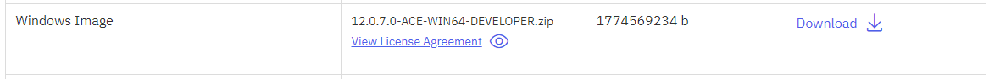

# ACE server container for Windows

This directory contains the files required to build a Windows container with a Windows
Server 2019 base image as the default. For other versions of Windows, see Microsoft
documentation for the correct base image, but note that the "nanoserver" base images
cannot be used with ACE due to their lack of MSI installer support.

This image includes the ACE product without the UI components (no toolkit or Electron app)
but does include all the server components except the WSRR nodes.

Build as follows: 
```
docker build -t ace-basic:12.0.10.0-windows  .
```

The Dockerfile is constructed to minimize the resulting image size, with the downloaded
files extracted, installed, and deleted within a single RUN command to avoid persisting
the install image in a layer. See [Google's image-creation best practices](https://cloud.google.com/architecture/best-practices-for-building-containers#reduce_the_amount_of_clutter_in_your_image)
for more information on that approach and how it helps reduce image size.

### Setting the correct product URL

The Dockerfile takes a `DOWNLOAD_URL` parameter that will need to be specified to build
a specific version of the product. This is provided on the command line using the 
`--build-arg` parameter, with a default in the Dockerfile that is unlikely to work.

This value will need updating to an ACE developer edition URL from the IBM website. Start
at https://www.ibm.com/docs/en/app-connect/12.0?topic=enterprise-download-ace-developer-edition-get-started
and proceed through the pages until the main download page with a link: 



The link is likely to be of the form
```
https://iwm.dhe.ibm.com/sdfdl/v2/regs2/mbford/Xa.2/Xb.WJL1cUPI9gANEhP8GuPD_qX1rj6x5R4yTUM7s_C2ue8/Xc.12.0.10.0-ACE-WIN64-DEVELOPER.zip/Xd./Xf.LpR.D1vk/Xg.12164875/Xi.swg-wmbfd/XY.regsrvs/XZ.pPVETUejcqPsVfDVKbdNu6IRpo4TkyKu/12.0.10.0-ACE-WIN64-DEVELOPER.zip
```
Copy that link into the Dockerfile itself or use it as the DOWNLOAD_URL build parameter.

## Building a Jenkins worker image

ACE can be used in a Jenkins container built from the standard Jenkins-provided 
Windows container. To build an ACE-enabled container image, add 
`--build-arg FROMIMAGE=jenkins/agent:windowsservercore-ltsc2019` to the server build line above:
```
docker build --build-arg FROMIMAGE=jenkins/agent:windowsservercore-ltsc2019 -t ace-jenkins:12.0.10.0-windows  .
```
and refer to it as normal from Jenkins. For a Jenkins pipeline, this might look as follows:
```
  agent { docker { image 'ace-jenkins:12.0.10.0-windows' } }
```